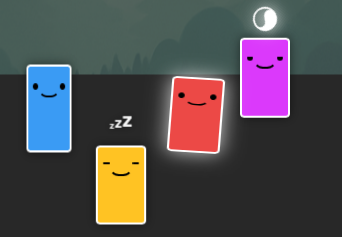
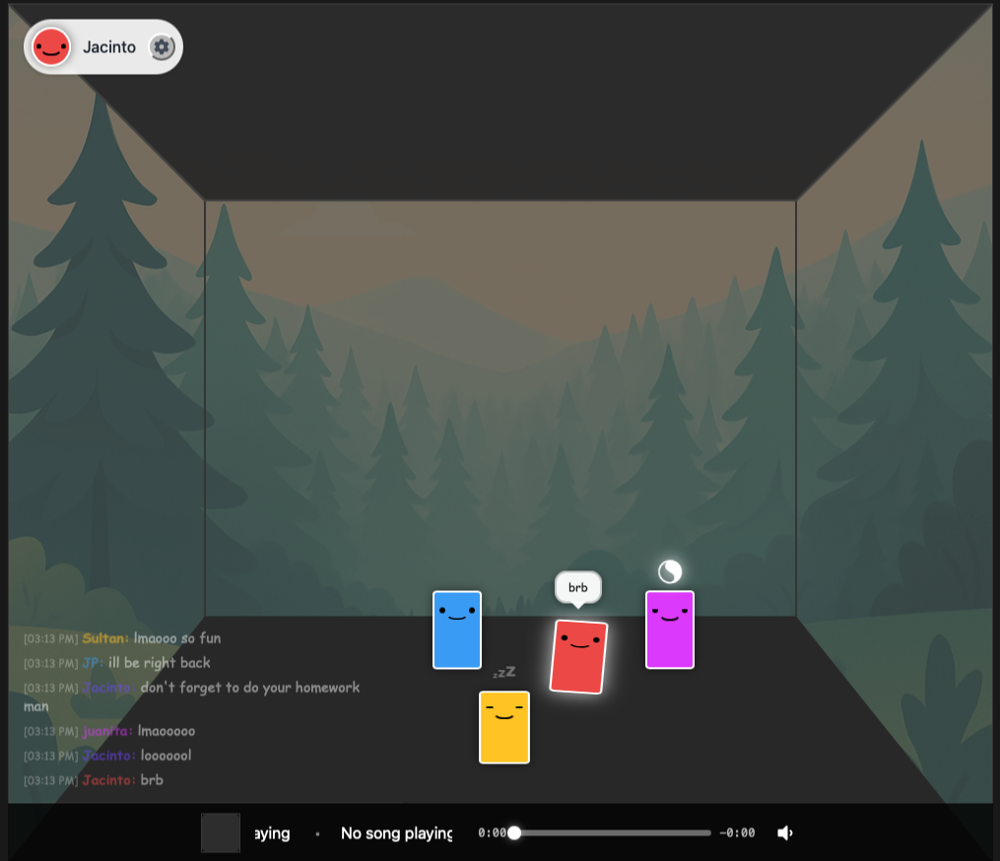
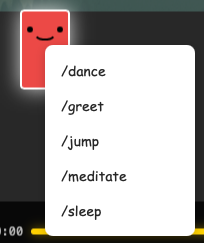
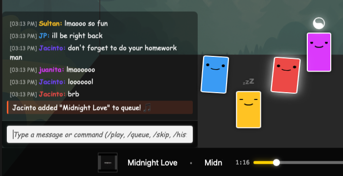
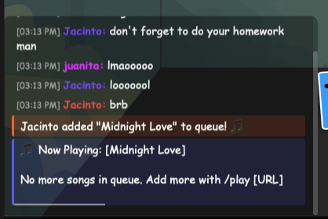

# Blob Radio

A small **multiplayer hangout in the browser**: you’re a blob in a room with friends—**walk the floor**, **chat** with names on every line, use **`/commands`** for emotes and jokes, and pipe **YouTube** into one **shared queue** so everyone’s on the same beat.

It’s inspired by other **virtual shared multiplayer** spaces—**Club Penguin** for how you **move**, **Minecraft** and **World of Warcraft** for **multiplayer chat** and slash commands, and **Discord** for **music bots** and typed commands so the group **listens together** on one queue.

---

## What you’ll find

- **Live room** — Walk the floor, emote, poke at other players’ names and menus.
- **Chat & commands** — [Reference](#chat-commands) for every slash shortcut.
- **Music queue** — Shared YouTube playback and queue commands for the session.

Under the hood it’s a **React + TypeScript** SPA talking to a **Node** server over **Socket.io**, with avatars, chat, and music state coordinated in memory for the session.

---

## Tech stack

| Area | Choices |
|------|---------|
| **UI** | React 19, TypeScript, Vite |
| **Styling** | Hand-rolled CSS—no utility framework; we paint our own widgets B) |
| **Realtime** | Socket.io end to end |
| **Server** | Express + Socket.io on Node |

---

## How it fits together

**In the browser**, the UI is split into a few clear roles—session, room, chat, music—so each concern stays easy to follow and change without tripping the rest.

**On the server**, one live session hub relays chat, keeps avatars and the shared music queue in sync, and holds that state **in memory** for as long as people are connected—not a separate database layer in this project.

**Socket.io** connects the two: fast event streams both ways so movement, chat, and audio state stay aligned across clients.

For more detail, see the **`context`** folder at the repo root.

---

## YouTube

Playback and link handling go through **Google’s YouTube-related APIs**: the embed **plays** in the page, and pasted URLs **resolve** to real titles and artwork instead of raw links.

The **queue** view shows what’s lined up next—**track names**, **length** when the API gives it, and a **thumbnail** per row—so everyone can read the lineup at a glance.

---

## Realtime

**Socket.io** carries the multiplayer feel: avatar updates, chat, and music state all flow over persistent connections so the room reacts quickly without polling.

---

## Your avatar

- **Move** — Click or touch an empty spot on the floor to walk there (straight-line movement; no teleporting across the map).
- **Emotes** — Dance, greet, jump, and meditate: short animations you can trigger from the **self** context menu or from chat commands (same actions, same outcome—we care about that consistency).
- **Others** — Open someone’s context menu (right-click or long-press on touch) to see who they are; your own menu is where the fun action buttons live.

Chat stays available while you hang out; when the chat input is open, it takes priority so you don’t accidentally walk away mid-sentence.

---

## Chat commands

Commands start with **`/`**. Type **`/help`** anytime for a built-in reminder.

A lot of **command feedback** shows up as **temporary** lines—confirmations, errors, and tips that **fade or disappear** after a moment instead of sitting in the log like normal chat.

**Avatar**

| Command | What it does |
|--------|----------------|
| `/dance` | Toggle dance; stops meditation when you start. |
| `/greet` | Quick greeting animation. |
| `/jump` | Quick jump animation. |
| `/meditate` | Toggle meditate; stops dancing when you start. |

**Music (shared queue)**

| Command | What it does |
|--------|----------------|
| `/play …` | Add a **YouTube** URL (single video or playlist where supported). |
| `/skip` | Skip the current track. |
| `/stop` | Clear the queue and stop playback. |
| `/remove n` | Remove the *n*-th **upcoming** track (1 = next up; not the playing song). |
| `/queue` | Show now playing and what’s up next. |
| `/history` | Show recently played tracks. |
| `/shuffle` | Shuffle the queue when there are enough songs (see in-app feedback if not). |

**Chat & misc**

| Command | What it does |
|--------|----------------|
| `/help` | List commands. |
| `/clear` | Clear **your** chat message list on **your** screen only. |

Normal text (no `/`) sends a chat message to the room.

---

## Built with love—and **Cursor**

This is a project I **planned years ago**—the **room**, **avatars**, and **shared session** were already **clear in my head** long before they existed in code. What made it slow to realize was **complexity**, not lack of interest: **SVG** and **canvas** each take real skill on their own, and the **harder layer** is getting that graphics work to **interact reliably with JavaScript** while you chase responsive, real-time behavior—then **multiplayer** stacks more moving parts on top. That whole combination was **time-consuming and easy to get wrong**; **after work**, I rarely had enough **time** or **quiet focus** to see it through alone, so for years it stayed **design and intent**, not a shipped product.

The **AI-assisted** workflow changed that: quicker iteration, fewer dead ends, and a realistic path to shipping. This repo was also an **exercise in what AI and Cursor can do** on a non-trivial app. **Everything I’ve given the models**—product context, architecture notes, tone, guardrails—lives in the **`context`** folder at the repo root. Written that way so **Cursor** could align with what I mean by **avatar**, **room**, and **context** inside this application—instead of guessing from generic training data alone.
